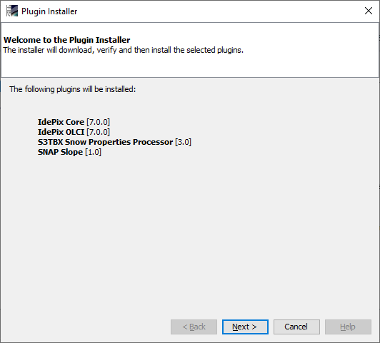

.. index:: S3-SNOW Processor Installation
.. _s3snow_installation:

=====================
Software Installation
=====================

.. BC

Overview
========

This chapter describes the overall S3-SNOW software installation procedure.

.. index:: Usage Requirements

Usage Requirements
==================

General Requirements
--------------------

The S3-SNOW and SICE processors require SNAP in the latest release version (v7.0.0), which is available
for all platforms (Windows, Linux, MacOS) from the SNAP website (step.esa.int).

Operating System
----------------

The S3-SNOW software can be run on any operating system which is suppported by SNAP (Windows, Linux, MacOS).

Hardware Requirements
---------------------

The S3-SNOW / SICE processing system is a complex piece of software. Although the algorithms for the snow properties
retrieval are mostly relatively simple, the effort for data input/output is fairly high in case of full resolution
OLCI products.
Therefore, up-to-date and  sufficiently powerful and
dimensioned hardware is strongly recommended for reliable and convenient processing.

.. index:: Contents of Software Bundle

Contents of the S3-SNOW / SICE Processing Software Bundle
=========================================================

The S3-SNOW / SICE processing software consists of the following components:

- *s3tbx-snow-3.0.nbm*: nbm plugin file
- *snap-slope-1.0.nbm*: nbm plugin file
- GIMP Digital Elevation Model for Greenland: GeoTIFF auxiliary file

Processors for Rayleigh correction and for IdePix pixel classification are included in the SNAP software. The
Rayleigh correction processor is installed automatically as part of the SNAP installation, the IdePix processor for
OLCI needs to be installed from the plugin manager in SNAP Desktop (described in more detail below).

.. index:: How to get the Software

How to get the Software
=======================

The S3-SNOW processing software bundle can be obtained from the S3-SNOW ftp site hosted at BC with the
following configuration:

- FTP, Port 21
- ftp.brockmann-consult.de
- username: s3snow
- password: $3Sn0W@bc
- subdirectory: software

.. index:: Installation Process

Installation Steps
==================

Installation of the SNAP Software
---------------------------------

Download SNAP (Unix version) from the SNAP web site [`4 <intro.html#References>`_] and follow the
information and instructions for installation given there.

Installation of the S3-SNOW Processor modules
---------------------------------------------

Once SNAP has been installed, the installation of all NBM plugin files needs to be done from the 'Plugins' toolwindow
in the SNAP Desktop application. This is illustrated in the figure sequence :numref:`plugins_in_tools_menu` to
:numref:`add_plugins_confirm_restart`.

.. _plugins_in_tools_menu:
.. figure::  pix/plugins_in_tools_menu.png
   :align:   center
   :scale: 80 %

   The SNAP menu entry for installation of plugins.

.. _add_plugins:
.. figure::  pix/add_plugins.png
   :align:   center
   :scale: 80 %

   Selection of plugins to be installed. (Note that the IdePix OLCI plugin is shipped with SNAP and is listed under
   'Available Plugins', whereas the plugin for S3-SNOW / SICE needs to be accessed through the 'Download' tab from
   the local disk after download from S3-SNOW ftp site. Also note that the 'IdePix core' plugin needs to be installed
   in addition to the 'IdePix OLCI'.)

.. _add_plugins_confirm:

   Confirmation of selected plugins (step 1 of 4).

.. _add_plugins_confirm_restart:
.. figure::  pix/add_plugins_confirm_restart.png
   :align:   center
   :scale: 60 %

   Final confirmation for restart after selection of plugins.

After restart of SNAP, the installed processors will be available from their dedicated menu entries. This will be
shown in more detail in the next chapter.

