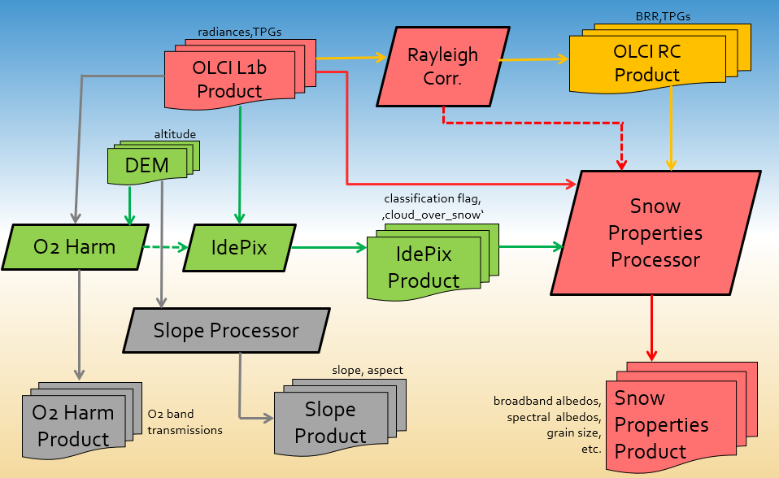

.. role:: underline
    :class: underline

.. index:: SNAP S3-SNOW Processors

.. _s3snow_processing_system:

===========================
The SNAP S3-SNOW Processors
===========================

Overview
========

The key goal of the S3-SNOW project regarding software development, production and dissemination was to
implement the proposed algorithms for several  key  snow  parameters from  Sentinel-3 OLCI data in free and easily
accessible open source toolboxes, notably and foremost ESA’s SNAP toolbox.
During the implementation process, all processing software was distributed within the consortium in frequent cycles
for the purpose of a comprehensive validation from an appropriate OLCI database containing products covering a variety of
selected snow-covered areas. All SNAP
S3-SNOW processors are available as SNAP plugins and can be run within SNAP on any supported platform
(Windows, Linux, MacOS). The :underline:`procedure` for installation and operation is described in this chapter.

.. index:: Theoretical Background Summary

Theoretical Background
======================

The motivation and theoretical background for the retrieval of key snow parameters is summarized in the S3-SNOW project
proposal [`1 <intro.html#References>`_].
The underlying algorithms are described in detail in the corresponding project ATBD  [`2 <intro.html#References>`_].

.. index:: Processing Environment

Processing Environment
======================

As said, the S3-SNOW processors are available as SNAP plugins and can be run within SNAP on any supported platform
(Windows, Linux, MacOS).
The chapter :doc:`s3snow_installation` describes in more detail how to install the plugins in SNAP.

.. index:: Processing Components

Processing Components
=====================

The SNAP S3-SNOW processing software consists of the following components and auxiliary datasets:

- *snap-core* module
- *snap-gpf* module
- *s3tbx-idepix-olci* plugin (specific version for S3-SNOW)
- *s3tbx-olci-o2corr* plugin
- *s3tbx-snow* plugin
- *snap-slope* plugin
- GIMP Digital Elevation Model for Greenland
- lookup tables for OLCI O2 correction

These components are described in more detail in the following subsections.

The Sentinel Application Platform (SNAP)
----------------------------------------

A common architecture for all Sentinel Toolboxes has been jointly developed by Brockmann Consult, Array Systems
Computing and C-S called the Sentinel Application Platform (SNAP).

The SNAP architecture is ideal for Earth Observation processing and analysis due to various technological
innovations as well as approved concepts from the BEAM toolbox. Most of the software components listed above make
use of various SNAP core capabilities.

A good starting point for much more detailed information is the SNAP homepage [`4 <intro.html#References>`_], and also
the comprehensive help documentation integrated in the SNAP desktop application.

The SNAP Graph Processing Framework
-----------------------------------

One of the key components in SNAP is the Graph
Processing Framework (GPF) for creating user-defined processing chains. All provided S3-SNOW processors make use of this
framework.

Within SNAP, the term data processor refers to a software module which creates an output product from one or more
input products configured by a set of processing parameters.
The GPF framework was originally developed for the BEAM toolbox, the precursor of SNAP.
Since the early days of BEAM, a number of data processors have been developed; some of them are standard modules while others
are contributed by 3rd parties. All of these data processors have been developed using a dedicated processing
framework which was already part of the first version of BEAM.

Based on the experience collected within a number of projects, the SNAP authors have developed what is now the
SNAP Graph Processing Framework.
The GPF provides all the features inherited from BEAM, but adds a number of new ones for developers and
reduces the amount of source code to write while drastically improving its readability and maintainability.

Much more detailed information on the SNAP GPF is provided by
the specific GPF help documentation integrated in the SNAP desktop application.

The OLCI Snow Properties Processor
----------------------------------

The Snow Properties Processor (SPP) is the key component for the processing in S3-SNOW. The processor provides the
implementation
of the algorithms for the various snow properties of interest. These algorithms are also described
in detail in [`2 <intro.html#References>`_].

As input, the processor requires an OLCI L1b product (original or being Rayleigh corrected in a preprocessing step).
Optionally, an IdePix pixel classification product (see below) can be provided as additional input. The output is a set of
snow properties of interest, defined by the user via processing parameters. This is described in detail in
the chapter :doc:`s3snow_usage`.

The IdePix OLCI Pixel Classification Processor
----------------------------------------------

IdePix (Identification of Pixels) is a pixel classification tool which has been developed by BC originally for BEAM
and has been used for a variety of projects. It was transferred to SNAP and is continuously being further
developed.

Among the supported sensors is OLCI, which made IdePix the most appropriate candidate for cloud and snow identification in
the S3-SNOW project.

Originally, IdePix has been developed as an internal component of the SNAP Sentinel-3 toolbox. To increase flexibility,
the sub-processors for the various sensors were recently extracted to make them available as separate plugins.
One of these plugins is the IdePix Sentinel-3 OLCI processor.
The processor described here is a special version of this plugin, being adapted for the specific needs for a pixel
classification within S3-SNOW. This allows to more easily provide special user options which are ultimately not
needed in other projects than S3-Snow, and in return leave out other options which are not relevant for S3-Snow.

The IdePix classification algorithm for Sentinel-3 OLCI is based on a neural network approach. A common neural net
is used for both land and water pixels. As input for the neural net, the square roots of the OLCI TOA reflectances
(obtained from an internal radiance-to-reflectance conversion) at all 21 wavelengths are used. As output, the neural net
finally provides per pixel one of the properties 'cloud sure', 'cloud ambiguous', 'cloud'
(which means sure OR ambiguous), or 'snow/ice'.

Although the IdePix classification for OLCI has been tested and successively improved
within various activities, some limitations and weaknesses in cloud detection (most of them well
known from other existing cloud masking approaches) could not be solved to 100%. Among these is the distiction of
cloud and snow/ice, which is very important for the usage for S3-SNOW, and which has shown to be often rather poor.
Therefore, a new approach to detect clouds over snow/ice has been introduced in the IdePix OLCI version for S3-SNOW
which makes use of the O2 correction algorithm provided by R.Preusker (Spectral Earth, Berlin), and which has been
implemented in the OLCI O2 Correction Processor (see next section). As additional output, a binary band 'cloud_over_snow'
is provided.

The pixel classification with IdePix is an optional processing step in S3-SNOW (although recommended in most cases),
applied on the same OLCI L1b products which are being considered for the snow properties retrieval.

The OLCI O2 Correction Processor
--------------------------------

The OLCI O2 Correction Processor provides a 'harmonisation' of O2 wavebands, which means a modification of the effective
transmittances in O2A wavebands 13, 14 and 15 to their values which would be measured at their mean wavelengths and with
nominal bandwidth. The corresponding algorithm was provided by R.Preusker (Spectral Earth, Berlin) and is described
in detail in [`2 <intro.html#References>`_]. Among various outputs, the processor provides the rectified and desmiled
transmission for OLCI waveband 13 (761.25nm) which is used by the IdePix classification for the detection of clouds
over snow (previous subsection).

The SNAP Slope Processor
------------------------

The Slope Processor provides pixelwise terrain slope and aspect angle from an arbitrary input product containing
a band with terrain height (i.e. a DEM product). For S3-SNOW this processor is provided as utility tool, as slope
and aspect are often useful information for the validation of snow properties.

The GIMP Digital Elevation Model for Greenland
----------------------------------------------

A Digital Elevation Model for Greenland has been generated within the GIMP project. This product has been post-processed
by BC and is provided in GeoTIFF format with a resolution of ~90m. As only layer in this product, the DEM altitude
given in metres is provided. The altitude is e.g. used as input by the OLCI O2 Correction Processor.
The GIMP DEM product is illustrated in :numref:`gimp_dem`.

.. _gimp_dem:

    
   Illustration of the GIMP DEM for Greenland.

Using the SNAP Slope Processor, this product can be used as input to derive the corresponding slope and aspect.

Lookup Tables
-------------

Various lookup tables are used for the OLCI O2 correction, which in return is part of the IdePix OLCI
pixel classification, all described in more detail in
[`2 <intro.html#References>`_]. These lookup tables are not provided separately, but as an internal part of the
OLCI O2 correction processor plugin.

.. index:: Processing Flow

Processing Flow
===============

The overall processing flow and the interaction of the S3-SNOW components are illustrated in :numref:`processing_flow`.

.. _processing_flow:

   Processing flow of the S3-SNOW processors. See text for details.

The colour and arrow scheme in the diagram has the following meaning:

- **red** : The standard processing flow for snow properties retrieval. The red boxes indicate the mandatory input products
  and processing modules: An OLCI L1b radiances product is used as input product for the SPP.
  Internally, BRRs are computed from a call of the SNAP Rayleigh Correction Processor, which in return are used for the
  retrieval of the various snow properties.
- **orange** : Alternative processing flow for snow properties retrieval: An OLCI BRR product is used as input product
  for the SPP. This BRR product has been computed independently in a preprocessing step, directly
  using the Rayleigh Correction Processor.
- **green** : Optional processing, i.e. cloud classification: An OLCI L1b radiances product is used as input product
  for the IdePix Pixel Classification Processor. The IdePix output product can then be used as optional second input
  product for the SPP. Internally, IdePix calls the O2 Correction Processor to obtain the
  O2 waveband transmissions being used to generate the improved cloud classification band 'cloud_over_snow'. An optional
  DEM product can be used as input for the O2 Correction Processor. If no DEM is specified by the user, the altitude band
  from the Olci L1b product is used.
- **grey** : Additional processing options, not directly used in the snow properties retrieval. I.e., O2 correction
  and slope/aspect computation, as outlined above.
- **solid arrows** : indicate input/output to/from a processing module
- **dashed arrows** : indicate internal calls of one processing module into another

