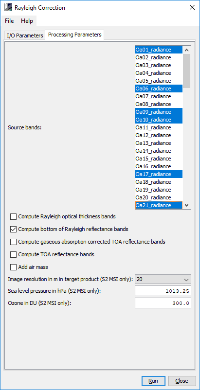

.. |vspace| raw:: latex

   \vspace{5mm}

.. |br| raw:: html

    

.. index:: S3-SNOW Products
.. _s3snow_products:

====================
The S3-SNOW Products
====================

Overview
========

This section will give an overview of all input, intermediate, optional and final products used and generated by the SNAP
S3-SNOW and SICE processors introduced in the previous chapter.

.. index:: Input Products

Input Products
==============

OLCI L1b TOA Radiance Product
-----------------------------

Both reduced and full resolution OLCI L1b TOA radiance products can
be used as input data. Tables 3.1 to 3.4 give an overview of
OLCI L1b bands, tie point grids and L1b flag coding, respectively. A more detailed description of the OLCI
standard L1b product is given in [`3 <intro.html#References>`_]. (Note that in SNAP terminology, the term 'bands'
does not only refer to 'spectral bands' (i.e., 1-21 for OLCI), but for all raster data quantities read or written by SNAP.)

|vspace| |br|

.. _olci_bands_l1b:
.. table:: OLCI bands in L1b product

    +----------------------------------+---------------------+------------+---------------------------------+
    |     **Name in product**          |       **Unit**      |   **Type** |        **Description**          |
    +==================================+=====================+============+=================================+
    | Oa<nn>_radiance; n=01,..,21      | mW/(m^2*sr*nm)      | float32    | TOA radiance in band <nn>       |
    +----------------------------------+---------------------+------------+---------------------------------+
    | lambda0_band_<nn>; n=01,..,21    | nm                  | float32    | Central wavelength in band <nn> |
    +----------------------------------+---------------------+------------+---------------------------------+
    | FWHM_band_<nn>; n=01,..,21       | nm                  | float32    | Bandwidth in band <nn>          |
    +----------------------------------+---------------------+------------+---------------------------------+
    | solar_flux_band_<nn>; n=01,..,21 | mW/(m^2*nm)         | float32    | Solar flux in band <nn>         |
    +----------------------------------+---------------------+------------+---------------------------------+
    |       quality_flags              | dl (flag band)      | int32      | L1b quality flags               |
    +----------------------------------+---------------------+------------+---------------------------------+
    |    altitude                      |        m            | float32    | Altitude                        |
    +----------------------------------+---------------------+------------+---------------------------------+
    |    latitude                      |        degrees      | float32    | Latitude                        |
    +----------------------------------+---------------------+------------+---------------------------------+
    |    longitude                     |        degrees      | float32    | Longitude                       |
    +----------------------------------+---------------------+------------+---------------------------------+
    |    frame_offset                  |        dl           | float32    | Resampling frame offset         |
    +----------------------------------+---------------------+------------+---------------------------------+
    |    detector_index                |        dl           | float32    | Detector index                  |
    +----------------------------------+---------------------+------------+---------------------------------+

|vspace| |br|

.. _olci_instrument_channels:
.. table:: OLCI instrument channels.

    +-------------------------------+------------------------------+
    | **Channel**                   | **Wavelength (nm)**          |
    +===============================+==============================+
    | 1                             | 400.0                        |
    +-------------------------------+------------------------------+
    | 2                             | 412.5                        |
    +-------------------------------+------------------------------+
    | 3                             | 442.5                        |
    +-------------------------------+------------------------------+
    | 4                             | 490                          |
    +-------------------------------+------------------------------+
    | 5                             | 510                          |
    +-------------------------------+------------------------------+
    | 6                             | 560                          |
    +-------------------------------+------------------------------+
    | 7                             | 620                          |
    +-------------------------------+------------------------------+
    | 8                             | 665                          |
    +-------------------------------+------------------------------+
    | 9                             | 673.75                       |
    +-------------------------------+------------------------------+
    | 10                            | 681.25                       |
    +-------------------------------+------------------------------+
    | 11                            | 708.75                       |
    +-------------------------------+------------------------------+
    | 12                            | 753.75                       |
    +-------------------------------+------------------------------+
    | 13                            | 761.25                       |
    +-------------------------------+------------------------------+
    | 14                            | 764.375                      |
    +-------------------------------+------------------------------+
    | 15                            | 767.5                        |
    +-------------------------------+------------------------------+
    | 16                            | 778.75                       |
    +-------------------------------+------------------------------+
    | 17                            | 865                          |
    +-------------------------------+------------------------------+
    | 18                            | 885                          |
    +-------------------------------+------------------------------+
    | 19                            | 900                          |
    +-------------------------------+------------------------------+
    | 20                            | 940                          |
    +-------------------------------+------------------------------+
    | 21                            | 1020                         |
    +-------------------------------+------------------------------+

|vspace| |br|

.. _olci_tpgs:
.. table:: OLCI tie point grids in L1b product.

    +-----------------------------+----------+--------------+-----------------------------------------------+
    | **Name in product**         | **Unit** |   **Type**   |        **Description**                        |
    +=============================+==========+==============+===============================================+
    | TP_latitude                 |   deg    |   float32    | Latitude of the tie points                    |
    +-----------------------------+----------+--------------+-----------------------------------------------+
    | TP_longitude                |   deg    |   float32    | Longitude of the tie points                   |
    +-----------------------------+----------+--------------+-----------------------------------------------+
    | SZA                         |   deg    |   float32    | Sun zenith angle                              |
    +-----------------------------+----------+--------------+-----------------------------------------------+
    | SAA                         |   deg    |   float32    | Sun azimuth angle                             |
    +-----------------------------+----------+--------------+-----------------------------------------------+
    | OZA                         |   deg    |   float32    | View zenith angle                             |
    +-----------------------------+----------+--------------+-----------------------------------------------+
    | OAA                         |   deg    |   float32    | View azimuth angle                            |
    +-----------------------------+----------+--------------+-----------------------------------------------+
    | horizontal_wind_vector_1    |   m/s    |   float32    | Zonal wind component                          |
    +-----------------------------+----------+--------------+-----------------------------------------------+
    | horizontal_wind_vector_2    |   m/s    |   float32    | Meridional wind component                     |
    +-----------------------------+----------+--------------+-----------------------------------------------+
    | total_columnar_water_vapour |   kg/m^2 |   float32    | Total column of water vapour                  |
    +-----------------------------+----------+--------------+-----------------------------------------------+
    | sea_level_pressure          |   hPa    |   float32    | Mean sea level pressure                       |
    +-----------------------------+----------+--------------+-----------------------------------------------+
    | ozone                       |   kg/m^2 |   float32    | Total ozone                                   |
    +-----------------------------+----------+--------------+-----------------------------------------------+
    | humidity                    |   %      |   float32    | Relative humidity                             |
    +-----------------------------+----------+--------------+-----------------------------------------------+

|vspace| |br|

.. _olci_l1b_flag_coding:
.. table:: OLCI L1b flag coding.

    +-------------------------------+------------------------------+-------------------------------+
    | **Bit**                       | **Flag**                     | **Description**               |
    +===============================+==============================+===============================+
    | 0-20                          | saturated_Oa<21-nn>          | Band <nn> is saturated        |
    +-------------------------------+------------------------------+-------------------------------+
    | 21                            | dubious                      | Pixel is cosmetic             |
    +-------------------------------+------------------------------+-------------------------------+
    | 22                            | sun_glint_risk               | Pixel has been duplicated     |
    +-------------------------------+------------------------------+-------------------------------+
    | 23                            | duplicated                   | Pixel has glint risk          |
    +-------------------------------+------------------------------+-------------------------------+
    | 24                            | cosmetic                     | Pixel is suspect              |
    +-------------------------------+------------------------------+-------------------------------+
    | 25                            | invalid                      | Pixel is over land,           |
    +-------------------------------+------------------------------+-------------------------------+
    | 26                            | straylight_risk              | Pixel is bright               |
    +-------------------------------+------------------------------+-------------------------------+
    | 27                            | bright                       | Pixel is part of a coastline  |
    +-------------------------------+------------------------------+-------------------------------+
    | 28                            | tidal_region                 | Pixel is suspect              |
    +-------------------------------+------------------------------+-------------------------------+
    | 29                            | fresh_inland_water           | Pixel is over land            |
    +-------------------------------+------------------------------+-------------------------------+
    | 30                            | coastline                    | Pixel is bright               |
    +-------------------------------+------------------------------+-------------------------------+
    | 31                            | land                         | Pixel is part of a coastline  |
    +-------------------------------+------------------------------+-------------------------------+

|vspace| |br|

OLCI L1b Bottom-of-Rayleigh Reflectances (BRR) Product
------------------------------------------------------

As outlined in the previous chapter,
the S3-SNOW Snow Properties Processor also accepts BRR [#f1]_ products as an alternative to the OCLI L1b
radiance products, whereas the SICE processor needs them as mandatory input in addition to the L1b products.
These BRR [#f1]_ products must have been generated in a pre-processing step using the
SNAP Rayleigh Correction Processor. This processor can be accessed from the SNAP Desktop application as shown in
:numref:`rayleigh_in_snap`.

.. rubric:: Footnotes

.. [#f1] Physically, the term 'BRR' used in the Rayleigh Correction Processor should better be called 'BOAR' (Bottom-of-atmosphere reflectance). The BOAR is derived from Top-of-atmosphere reflectance by correction for molecular scattering and absorption.

.. _rayleigh_in_snap:

   Access to Rayleigh Correction Processor in SNAP Desktop.

The Rayleigh Correction Processor is a SNAP build-in component. For a detailed description see the corresponding SNAP
help documentation. For BRR products to be used with the Snow Properties Processor, BRR for spectral bands 1, 6, 17 and 21
(400nm, 560, 865 and 1020nm) must be generated, and in addition the BRRs for all other spectral bands of interest.
For the SICE processor, bands 10 and 11 (681 and 708nm) are also mandatory in addition to  bands 1, 6, 17 and 21.
In the example shown in :numref:`rayleigh_params`, the parameter settings to generate
BRR in bands 1, 6, 17 and 21, and in addition bands 9 and 10, are shown.

.. _rayleigh_params:

   Rayleigh Correction: parameters for the generation of BRR in spectral bands 1, 5, 17 and 21, and in addition in spectral bands 9 and 10.

The bands in the resulting BRR product are listed in Table 3.5.

.. _rc_bands:
.. table:: Bands in BRR product

    +-------------------------+---------------------+------------+----------------------------------------------------------+
    |     **Name in product** |       **Unit**      |   **Type** |        **Description**                                   |
    +=========================+=====================+============+==========================================================+
    | rBRR_01                 | dl                  | float32    | Bottom-of-Rayleigh reflectance for band 1 (400nm)        |
    +-------------------------+---------------------+------------+----------------------------------------------------------+
    | rBRR_05                 | dl                  | float32    | Bottom-of-Rayleigh reflectance for band 5 (510nm)        |
    +-------------------------+---------------------+------------+----------------------------------------------------------+
    | rBRR_08                 | dl                  | float32    | Bottom-of-Rayleigh reflectance for band 8 (665nm)        |
    +-------------------------+---------------------+------------+----------------------------------------------------------+
    | rBRR_09                 | dl                  | float32    | Bottom-of-Rayleigh reflectance for band 9 (673nm)        |
    +-------------------------+---------------------+------------+----------------------------------------------------------+
    | rBRR_17                 | dl                  | float32    | Bottom-of-Rayleigh reflectance for band 17 (865nm)       |
    +-------------------------+---------------------+------------+----------------------------------------------------------+
    | rBRR_21                 | dl                  | float32    | Bottom-of-Rayleigh reflectance for band 21 (1020nm)      |
    +-------------------------+---------------------+------------+----------------------------------------------------------+
    | rBRR_<nn>               | dl                  | float32    | Bottom-of-Rayleigh reflectance in band <nn> (optional)   |
    +-------------------------+---------------------+------------+----------------------------------------------------------+
    | quality_flags           |        dl           | int32      | L1b quality flags                                        |
    +-------------------------+---------------------+------------+----------------------------------------------------------+

Intermediate and Optional Products
==================================

SNAP IdePix Classification Product
----------------------------------

The IdePix classification product is the result of the pixel classification performed on the OLCI L1b
product. In return, the IdePix product can be used as optional input for Snow Properties Processor.
The IdePix OLCI classification product generated with default user options containing the flag bands
listed in Table 3.6. Optionally, more bands can be written to the classification product, as described in more
detail in the IdePix processor help documentation. However, the S3-SNOW and SICE just need the pixel classification
band.

.. _idepix_bands:
.. table:: Bands in IdePix pixel classification product

    +-------------------------+---------------------+------------+----------------------------------------------------------+
    |     **Name in product** |       **Unit**      |   **Type** |        **Description**                                   |
    +=========================+=====================+============+==========================================================+
    | pixel_classif_flags     |        dl           | int16      | Standard IdePix classification flag band                 |
    +-------------------------+---------------------+------------+----------------------------------------------------------+
    | quality_flags           |        dl           | int32      | L1b quality flags                                        |
    +-------------------------+---------------------+------------+----------------------------------------------------------+

The IdePix OLCI classification flag coding is given in Table 3.7.

.. _idepix_flagcoding:
.. table:: Bands in IdePix pixel classification product

    +------------+------------------------+-------------------------------------------------------------+
    | **Bit**    | **Flag**               | **Description**                                             |
    +============+========================+=============================================================+
    | 0          | IDEPIX_INVALID         | Pixel is invalid                                            |
    +------------+------------------------+-------------------------------------------------------------+
    | 1          | IDEPIX_CLOUD           | Pixel is either 'cloud sure' or 'cloud ambiguous'           |
    +------------+------------------------+-------------------------------------------------------------+
    | 2          | IDEPIX_CLOUD_AMBIGUOUS | Semi-transparent clouds, or detection is uncertain          |
    +------------+------------------------+-------------------------------------------------------------+
    | 3          | IDEPIX_CLOUD_SURE      | Fully opaque clouds with full confidence of detection       |
    +------------+------------------------+-------------------------------------------------------------+
    | 4          | IDEPIX_CLOUD_BUFFER    | A buffer of N pixels (user option) around a cloud           |
    +------------+------------------------+-------------------------------------------------------------+
    | 5          | IDEPIX_CLOUD_SHADOW    | Pixel is affected by a cloud shadow                         |
    +------------+------------------------+-------------------------------------------------------------+
    | 6          | IDEPIX_SNOW_ICE        | Snow or ice pixel                                           |
    +------------+------------------------+-------------------------------------------------------------+
    | 7          | IDEPIX_BRIGHT          | Pixel is bright                                             |
    +------------+------------------------+-------------------------------------------------------------+
    | 8          | IDEPIX_WHITE           | Pixel is white                                              |
    +------------+------------------------+-------------------------------------------------------------+
    | 9          | IDEPIX_COASTLINE       | Pixel is part of a coastline                                |
    +------------+------------------------+-------------------------------------------------------------+
    | 10         | IDEPIX_LAND            | Land pixel                                                  |
    +------------+------------------------+-------------------------------------------------------------+

O2 Correction Product
---------------------

The O2 correction step is done as part of the IdePix pixel classification. The results of this step are
used by IdePix internally, and no separate products are written in the S3-SNOW processing flow. However, as the
O2 correction is also available as a standalone SNAP plugin with a separate target product, its default
contents are listed in Table 3.8 for completeness.

.. _o2corr_bands:
.. table:: Bands in O2 Correction target product

    +-------------------------+---------------------+------------+-------------------------------------------------+
    |     **Name in product** |       **Unit**      |   **Type** |        **Description**                          |
    +=========================+=====================+============+=================================================+
    | trans_13                | dl                  | float32    | Rectified and desmiled transmission for band 13 |
    +-------------------------+---------------------+------------+-------------------------------------------------+
    | press_13                | hPa                 | float32    | Pressure for band 13 neglecting scattering      |
    +-------------------------+---------------------+------------+-------------------------------------------------+
    | surface_13              | dl                  | float32    | Rectified transmission for band 13              |
    +-------------------------+---------------------+------------+-------------------------------------------------+
    | radiance_13             | mW/(m^2*sr*nm)      | float32    | TOA radiance in band 13                         |
    +-------------------------+---------------------+------------+-------------------------------------------------+

Slope Product
-------------

A slope product is the output of the SNAP Slope Processor introduced in chapter :doc:`s3snow_processing_system`.
As mentioned, this is an optional product which is not directly used in the S3-SNOW processing flow.
For completeness, its contents are listed in Table 3.9.

.. _slope_bands:
.. table:: Bands in Slope Processor target product

    +-------------------------+---------------------+------------+---------------------------------------------+
    |     **Name in product** |       **Unit**      |   **Type** |        **Description**                      |
    +=========================+=====================+============+=============================================+
    | slope                   | degrees             | float32    | Terrain slope                               |
    +-------------------------+---------------------+------------+---------------------------------------------+
    | aspect                  | degrees             | float32    | Aspect angle in [0, 360] deg                |
    +-------------------------+---------------------+------------+---------------------------------------------+
    | elevation_variance      | degrees             | float32    | Variance of elevation over 3x3 pixel window |
    +-------------------------+---------------------+------------+---------------------------------------------+
    | <altitude_band>         | m                   | float32    | Altitude band from input product (optional) |
    +-------------------------+---------------------+------------+---------------------------------------------+

|vspace| |br|

.. index:: Final Products

Final Snow Properties Product
=============================

The S3-SNOW and SICE final products contain various snow properties, depending on the processing parameters specified by the user.
The maximum number of bands which can be generated with the S3-SNOW processor is given in Table 3.10.
For more detailed explanations of the physical meaning of the parameters, see [`2 <intro.html#References>`_].

.. _snowprop_bands:
.. table:: Bands in final S3-SNOW snow properties product

    +----------------------------------+---------------------+------------+--------------------------------------------+
    |     **Name in product**          |       **Unit**      |   **Type** |        **Description**                     |
    +==================================+=====================+============+============================================+
    |   albedo_bb_spherical_vis        | dl                  | float32    | Spherical albedo in BB visible range       |
    +----------------------------------+---------------------+------------+--------------------------------------------+
    |   albedo_bb_spherical_nir        | dl                  | float32    | Spherical albedo in BB near infrared range |
    +----------------------------------+---------------------+------------+--------------------------------------------+
    |   albedo_bb_spherical_sw         | dl                  | float32    | Spherical albedo in Bb shortwave range     |
    +----------------------------------+---------------------+------------+--------------------------------------------+
    |   albedo_bb_planar_vis           | dl                  | float32    | Planar albedo in BB visible range          |
    +----------------------------------+---------------------+------------+--------------------------------------------+
    |   albedo_bb_planar_nir           | dl                  | float32    | Planar albedo in BB near infrared range    |
    +----------------------------------+---------------------+------------+--------------------------------------------+
    |   albedo_bb_planar_sw            | dl                  | float32    | Planar albedo in BB shortwave range        |
    +----------------------------------+---------------------+------------+--------------------------------------------+
    |   albedo_spectral_spherical_<nn> | dl                  | float32    | Spectral spherical albedo in band <nn>     |
    +----------------------------------+---------------------+------------+--------------------------------------------+
    |   albedo_spectral_planar_<nn>    | dl                  | float32    | Spectral planar albedo in band <nn>        |
    +----------------------------------+---------------------+------------+--------------------------------------------+
    |   rBRR_<nn>                      | dl                  | float32    | BRR in band <nn> (max. 21 bands)           |
    +----------------------------------+---------------------+------------+--------------------------------------------+
    |   ppa_spectral_<nn>              | dl                  | float32    | PPA in band <nn> (max. 21 bands)           |
    +----------------------------------+---------------------+------------+--------------------------------------------+
    |   grain_diameter                 | mm                  | float32    | Snow grain diameter                        |
    +----------------------------------+---------------------+------------+--------------------------------------------+
    |   snow_specific_area             | m^2/kg              | float32    | Snow specific surface area                 |
    +----------------------------------+---------------------+------------+--------------------------------------------+
    |   ndbi                           | dl                  | float32    | Bare ice indicator                         |
    +----------------------------------+---------------------+------------+--------------------------------------------+
    |   pollution_mask                 | dl                  | float32    | Pollution mask                             |
    +----------------------------------+---------------------+------------+--------------------------------------------+
    |   f                              | 1/mm                | float32    | Snow impurity absorption coefficient       |
    +----------------------------------+---------------------+------------+--------------------------------------------+
    |   l                              | mm                  | float32    | Effective absorption length                |
    +----------------------------------+---------------------+------------+--------------------------------------------+
    |   m                              | dl                  | float32    | Absorption Angstrom parameter              |
    +----------------------------------+---------------------+------------+--------------------------------------------+
    |   r_0                            | dl                  | float32    | Reflectance of nonabsorbing snow layer     |
    +----------------------------------+---------------------+------------+--------------------------------------------+
    |   f_rel_err                      | dl                  | float32    | Relative error of parameter f              |
    +----------------------------------+---------------------+------------+--------------------------------------------+
    |   l_rel_err                      | dl                  | float32    | Relative error of parameter l              |
    +----------------------------------+---------------------+------------+--------------------------------------------+
    |   m_rel_err                      | dl                  | float32    | Relative error of parameter m              |
    +----------------------------------+---------------------+------------+--------------------------------------------+
    |   r_0_rel_err                    | dl                  | float32    | Relative error of parameter r_0            |
    +----------------------------------+---------------------+------------+--------------------------------------------+
    |   ndsi                           | dl                  | float32    | NDSI                                       |
    +----------------------------------+---------------------+------------+--------------------------------------------+
    |   ndsi_mask                      | dl                  | float32    | NDSI mask for snow identification          |
    +----------------------------------+---------------------+------------+--------------------------------------------+
    |   quality_flags                  | dl                  | int16      | L1b quality flags                          |
    +----------------------------------+---------------------+------------+--------------------------------------------+
    |   pixel_classif_flags            | dl                  | int16      | Pixel classification flags (see Table 3.7) |
    +----------------------------------+---------------------+------------+--------------------------------------------+

The maximum number of bands which can be generated with the SICE processor is given in Table 3.11.
Again, for more detailed explanations of the physical meaning of the parameters, see [`2 <intro.html#References>`_].

.. _snowprop_sice_bands:
.. table:: Bands in final SICE snow properties product

    +----------------------------------+---------------------+------------+--------------------------------------------+
    |     **Name in product**          |       **Unit**      |   **Type** |        **Description**                     |
    +==================================+=====================+============+============================================+
    |   albedo_bb_spherical_vis        | dl                  | float32    | Spherical albedo in BB visible range       |
    +----------------------------------+---------------------+------------+--------------------------------------------+
    |   albedo_bb_spherical_nir        | dl                  | float32    | Spherical albedo in BB near infrared range |
    +----------------------------------+---------------------+------------+--------------------------------------------+
    |   albedo_bb_spherical_sw         | dl                  | float32    | Spherical albedo in BB shortwave range     |
    +----------------------------------+---------------------+------------+--------------------------------------------+
    |   albedo_bb_planar_vis           | dl                  | float32    | Planar albedo in BB visible range          |
    +----------------------------------+---------------------+------------+--------------------------------------------+
    |   albedo_bb_planar_nir           | dl                  | float32    | Planar albedo in BB near infrared range    |
    +----------------------------------+---------------------+------------+--------------------------------------------+
    |   albedo_bb_planar_sw            | dl                  | float32    | Planar albedo in BB shortwave range        |
    +----------------------------------+---------------------+------------+--------------------------------------------+
    |   albedo_spectral_spherical_<nn> | dl                  | float32    | Spectral spherical albedo in band <nn>     |
    +----------------------------------+---------------------+------------+--------------------------------------------+
    |   albedo_spectral_planar_<nn>    | dl                  | float32    | Spectral planar albedo in band <nn>        |
    +----------------------------------+---------------------+------------+--------------------------------------------+
    |   grain_diameter                 | mm                  | float32    | Snow grain diameter                        |
    +----------------------------------+---------------------+------------+--------------------------------------------+
    |   snow_specific_area             | m^2/kg              | float32    | Snow specific surface area                 |
    +----------------------------------+---------------------+------------+--------------------------------------------+
    |   scattering_angle               | dl                  | float32    | Scattering angle.                          |
    +----------------------------------+---------------------+------------+--------------------------------------------+
    |   concentration_of_pollutants    | dl                  | float32    | Concentration of pollutants                |
    +----------------------------------+---------------------+------------+--------------------------------------------+
    |   ndbi                           | dl                  | float32    | NDBI ratio.                                |
    +----------------------------------+---------------------+------------+--------------------------------------------+
    |   ndsi                           | dl                  | float32    | NDSI ratio.                                |
    +----------------------------------+---------------------+------------+--------------------------------------------+
    |   sice_pollution_type_flags      | dl                  | int16      | SICE pollution type flags.                 |
    +----------------------------------+---------------------+------------+--------------------------------------------+
    |   sice_ground_type_flags         | dl                  | int16      | SICE ground type flags.                    |
    +----------------------------------+---------------------+------------+--------------------------------------------+
    |   quality_flags                  | dl                  | int16      | L1b quality flags                          |
    +----------------------------------+---------------------+------------+--------------------------------------------+
    |   pixel_classif_flags            | dl                  | int16      | Pixel classification flags                 |
    +----------------------------------+---------------------+------------+--------------------------------------------+

|vspace| |br|

