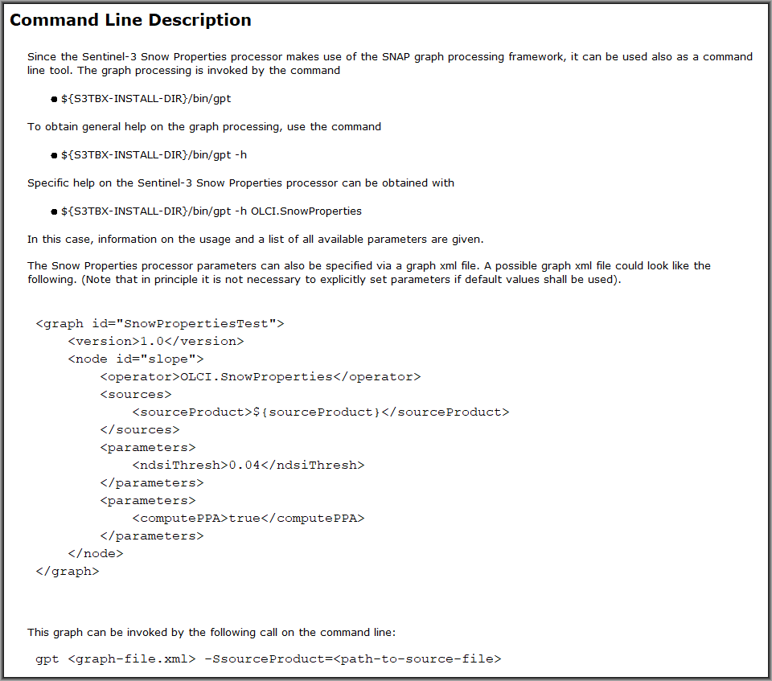

.. |vspace| raw:: latex

   \vspace{5mm}

.. |br| raw:: html

    

.. _s3snow_usage:

=================================
How to use the S3-SNOW Processors
=================================

Test of the Installation
========================

If all plugins described in chapter :doc:`s3snow_installation` were installed successfully in SNAP, the modules should be
visible in their dedicated menus as shown in the figure sequence :numref:`snow_properties_in_snap` to
:numref:`slope_in_snap`.

.. _snow_properties_in_snap:
.. figure::  pix/snow_properties_in_snap.png
   :align:   center
   :scale: 50 %

   The SNAP menu entry for the Snow Properties Processor.

.. _idepix_snow_in_snap:
.. figure::  pix/idepix_snow_in_snap.png
   :align:   center
   :scale: 50 %

   The SNAP menu entry for the IdePix Pixel ClassificationProcessor.

.. _o2corr_in_snap:
.. figure::  pix/o2corr_in_snap.png
   :align:   center
   :scale: 50 %

   The SNAP menu entry for the O2 Correction Processor.

.. _slope_in_snap:
.. figure::  pix/slope_in_snap.png
   :align:   center
   :scale: 50 %

   The SNAP menu entry for the Slope Processor.

The Snow Properties Processor
=============================

GUI Elements
------------

When the Snow Properties Processor is called from its menu entry, the processor GUI is displayed. It contains two
tabs 'I/O Parameters' and 'Processing Parameters' (:numref:`s3snow_tabs`).

.. _s3snow_tabs:
.. figure::  pix/s3snow_tabs.png
   :align:   center
   :scale: 60 %

   The SNAP Snow Properties Processor: I/O and processing parameters tabs.

From the main menu bar of the processor dialog window, the SNAP specific help documentation for this processor can
be invoked (:numref:`s3snow_help_from_menu`, :numref:`s3snow_help`). This documentation contains some general information,
a description of the underlying algorithms (i.e. dedicated references), a description of the processor I/O interface,
a description of the processing parameters, and a description how to run the processor from the command line.

.. _s3snow_help_from_menu:
.. figure::  pix/s3snow_help_from_menu.png
   :align:   center
   :scale: 60 %

   The SNAP Snow Properties Processor: Accessing the SNAP desktop help documentation.

.. _s3snow_help:
.. figure::  pix/s3snow_help.png
   :align:   center
   :scale: 60 %

   The SNAP Snow Properties Processor: Start page of the help documentation.

The text shown in :numref:`s3snow_help_iotab` describes the elements of the processor I/O tab and how to use it.

.. _s3snow_help_iotab:

   The SNAP Snow Properties Processor: Usage of the I/O tab (taken from the SNAP help documentation).

The texts shown in :numref:`s3snow_help_params_1` and :numref:`s3snow_help_params_2` list the processing parameters and
explains their meaning and how to use them.

.. _s3snow_help_params_1:
.. figure::  pix/s3snow_help_params_1.png
   :align:   center
   :scale: 60 %

   The SNAP Snow Properties Processor: Processing parameters (taken from the SNAP help documentation).

.. _s3snow_help_params_2:
.. figure::  pix/s3snow_help_params_2.png
   :align:   center
   :scale: 60 %

   The SNAP Snow Properties Processor: Processing parameters (continued, taken from the SNAP help documentation).

The text shown in :numref:`s3snow_help_cli` describes how to use the CLI (command line interface).

.. _s3snow_help_cli:

   The SNAP Snow Properties Processor: Usage of the CLI (taken from the SNAP help documentation).