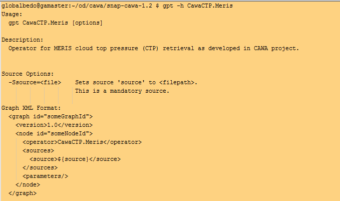

.. |vspace| raw:: latex

   \vspace{5mm}

.. |br| raw:: html

    

.. _cawa_usage:

=======================================
How to run the CAWA Processing Software
=======================================

Test of the Installation
========================

If all installation steps described in :ref:`cawa_installation` were finished successfully, the CAWA TCWV and CTP
GPF processors are now ready to run. First, test their availability with:
::

    $SNAP_INSTALL_DIR/bin/gpt -h

The three operators

- CawaTCWV.Meris
- CawaTCWV.Modis
- CawaCTP.Meris

should now appear in the listing of available SNAP operators, together with a short description.

The Pixel Classification Step
=============================

The pixel classification with IdePix is applied on the L1b input products. The operators for MERIS and MODIS

- Idepix.Meris
- Idepix.Modis

should also appear in the listing of available SNAP operators, together with a short description.

A more detailed information on the distinct operator can be obtained with
::

    $SNAP_INSTALL_DIR/bin/gpt -h <operator-name>

e.g.
::

    $SNAP_INSTALL_DIR/bin/gpt -h Idepix.Modis

(see :numref:`gpt_h_idepix_modis`).

.. _gpt_h_idepix_modis:

    GPF information for Idepix MODIS operator..

Processing Parameters
---------------------

The gpt command given above shows the possible IdePix processing parameters.
To ensure a correct workflow towards the TCWV and CTP processing, the following IdePix processing parameters
must be set as they deviate from the default (:numref:`idepix_params`):

|vspace| |br|

.. _idepix_params:
.. table:: Processing parameters deviating from defaults for CAWA IdePix classification step.

    +-----------------------------+-----------------+----------------------------------------------+
    |     **Operator**            |  **Parameter**  |   **Value**                                  |
    +=============================+=================+==============================================+
    |   Idepix.Meris (for TCWV)   | reflBandsToCopy | reflectance_13,reflectance_14,reflectance_15 |
    +-----------------------------+-----------------+----------------------------------------------+
    |   Idepix.Meris (for CTP)    | none            |                                              |
    +-----------------------------+-----------------+----------------------------------------------+
    |   Idepix.Modis (for TCWV)   | outputCawaRefSB | true                                         |
    +-----------------------------+-----------------+----------------------------------------------+

Applying these processing parameters, the calls for Idepix.Meris (TCWV, CTP) and Idepix.Modis (TCWV) would look like:

IdePix MERIS TCWV:
::

    gpt Idepix.Meris -SsourceProduct=<path-to-MERIS-L1b-product>
    -PreflBandsToCopy=reflectance_13,reflectance_14,reflectance_15
    -f NetCDF4-BEAM -t <path-to-idepix-meris-for-tcwv-product>

IdePix MERIS CTP:
::

    gpt Idepix.Meris -SsourceProduct=<path-to-MERIS-L1b-product>
    -f NetCDF4-BEAM -t <path-to-idepix-meris-for-ctp-product>

IdePix MODIS TCWV:
::

    gpt Idepix.Modis -SsourceProduct=<path-to-MERIS-L1b-product>
    -PreflBandsToCopy=reflectance_13,reflectance_14,reflectance_15
    -f NetCDF4-BEAM -t <path-to-idepix-meris-for-tcwv-product>

TCWV Processing
===============

The TCWV processing is applied on the 'extended' IdePix products as described in :ref:`cawa_products`.
The gpt command in :numref:`gpt_h_tcwv_modis` and :numref:`gpt_h_tcwv_modis` shows the possible TCWV processing
parameters for MERIS and MODIS, respectively.

.. _gpt_h_tcwv_meris:

    GPF information for TCWV MERIS operator.

.. _gpt_h_tcwv_modis:

    GPF information for TCWV MODIS operator.

Processing Parameters
---------------------

The operators for MERIS and MODIS

- CawaTCWV.Meris
- CawaTCWV.Modis

do not require any non-default parameters and are invoked via the SNAP gpt tool like:
::

    <operator-name> -SsourceProduct=<path-to-IdePix-product> -f NetCDF4-CAWA -t
    <path-to-target-product>

However, as discussed in :ref:`cawa_products`, it is strongly recommended to use IdePix 'extended' products
containing ERA-Interim data which provides more realistic prior variables. If these are not available, the processor
will use processor parameters for prior 2m temperature, mean sea level pressure and AOT. They can be explicitly
provided by the user, so a TCWV processor call may look like:
::

    CawaTCWV.Meris -SsourceProduct=<path-to-IdePix-product> -Ptemperature=285.0
    -Ppressure=990.0 -Paot_13=0.25
    -f NetCDF4-CAWA -t <path-to-target-product>

However, these values would be constant for all pixels of the given scene, so the resulting TCWV retrieval may be poor.

CTP Processing
==============

The CTP MERIS processing is applied on the 'extended' IdePix products as described in :ref:`cawa_products`.
The gpt command in :numref:`gpt_h_ctp_meris` shows the possible CTP MERIS processing options.

.. _gpt_h_ctp_meris:

    GPF information for TCWV MERIS operator.

Processing Parameters
---------------------

The operators for MERIS

- CawaCTP.Meris

does not require any non-default parameters and is invoked via the SNAP gpt tool like:
::

    CawaCTP.Meris -SsourceProduct=<path-to-IdePix-product> -f NetCDF4-CAWA
    -t <path-to-target-product>

Data Analysis Tools
===================

SNAP Desktop Application
------------------------

The TCWV and CTP products generated within the CAWA project are provided in CFcompliant
NetCDF-4/HDF5 format, which is supported by a variety of tools for further
scientific analysis and processing. One of the important tools are the BEAM toolbox
and its successor SNAP.

BEAM is the Basic ERS & Envisat (A)ATSR and MERIS Toolbox and is a collection of
executable tools and an application programming interface (API) which had been
developed to facilitate the use, viewing and processing of data of various sensors.
However, it is more recommended to use the latest version of the
SNAP toolboxes which do not only provide most of all existing BEAM functionalities and
product support, but also various new features as well as support for the new sensors
onboard the Sentinel-x satellites. The SNAP desktop application is directly available after having installed SNAP as
described in :ref:`cawa_installation`.

.. _gpt_h_snap_desktop:

    The SNAP desktop application splash screen.