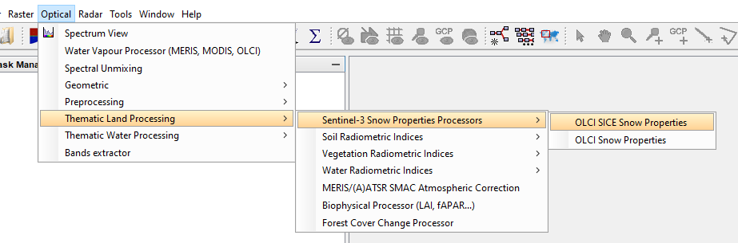
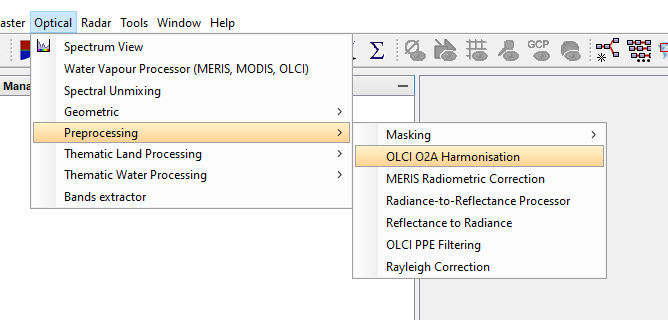
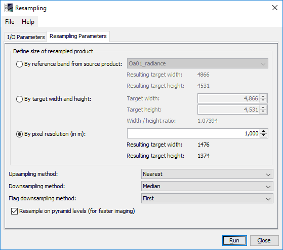
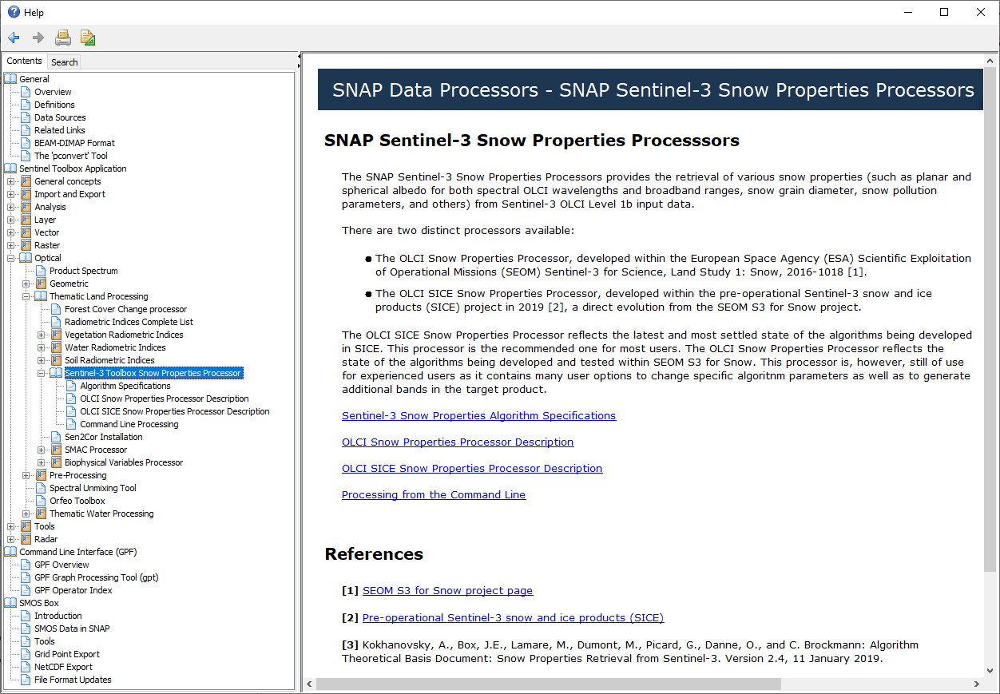

.. |vspace| raw:: latex

   \vspace{5mm}

.. |br| raw:: html

    

.. _s3snow_usage:

=================================
How to use the S3-SNOW Processors
=================================

Test of the Installation
========================

If all plugins described in chapter :doc:`s3snow_installation` were installed successfully in SNAP, the modules should be
visible in their dedicated menus as shown in the figure sequence :numref:`snow_properties_in_snap` to
:numref:`slope_in_snap`.

.. _snow_properties_in_snap:

   The SNAP menu entry for the SPP.

.. _idepix_snow_in_snap:

   The SNAP menu entry for the IdePix Pixel ClassificationProcessor.

.. _o2corr_in_snap:

   The SNAP menu entry for the O2 Correction Processor.

.. _slope_in_snap:
.. figure::  pix/slope_in_snap.png
   :align:   center
   :scale: 50 %

   The SNAP menu entry for the Slope Processor.

Test Products
=============

The S3-SNOW project delivery D2.4 'Task 2 Data Base' contains a variety of suitable Sentinel-3 OLCI L1b products which
can be used for initial tests of the functionalities of the single processors as well as for the whole processing flow.
These products can also be obtained from the S3-SNOW ftp site hosted at BC with the
following configuration:

- FTP, Port 21
- ftp.brockmann-consult.de
- username: s3snow
- password: $3Sn0W@bc
- subdirectories: data/<region> (Dome-C, French Alps, Greenland, Morteratsch)

The Snow Properties Processor
=============================

GUI Elements
------------

When the Snow Properties Processor is called from its menu entry, the processor GUI is displayed. It contains two
tabs 'I/O Parameters' and 'Processing Parameters' (:numref:`s3snow_tabs`).

.. _s3snow_tabs:

   The SNAP Snow Properties Processor: I/O and processing parameters tabs.

Help Documentation
------------------

From the main menu bar of the processor dialog window, an 'About' dialog showing general information on the
processor can also be displayed (:numref:`s3snow_help_about`).

.. _s3snow_help_about:

   The SNAP Snow Properties Processor: 'About' dialog window.

Also from the main menu bar of the processor dialog window, the SNAP specific help documentation for this processor can
be invoked (:numref:`s3snow_help_from_menu`, :numref:`s3snow_help`). This documentation contains some general information,
a description of the underlying algorithms (i.e. dedicated references), a description of the processor I/O interface,
a description of the processing parameters, and a description how to run the processor from the command line.

.. _s3snow_help_from_menu:
.. figure::  pix/s3snow_help_from_menu.png
   :align:   center
   :scale: 60 %

   The SNAP Snow Properties Processor: Accessing the SNAP desktop help documentation.

.. _s3snow_help:

   The SNAP Snow Properties Processor: Start page of the help documentation.

The text shown in :numref:`s3snow_help_iotab` describes the elements of the processor I/O tab and how to use it.

.. _s3snow_help_iotab:
.. figure::  pix/s3snow_help_iotab.png
   :align:   center
   :scale: 60 %

   The SNAP Snow Properties Processor: Usage of the I/O tab (taken from the SNAP help documentation).

The texts shown in :numref:`s3snow_help_params_1` and :numref:`s3snow_help_params_2` list the processing parameters and
explains their meaning and how to use them.

.. _s3snow_help_params_1:

   The SNAP Snow Properties Processor: Processing parameters (taken from the SNAP help documentation).

.. _s3snow_help_params_2:

   The SNAP Snow Properties Processor: Processing parameters (continued, taken from the SNAP help documentation).

The text shown in :numref:`s3snow_help_cli` describes how to use the CLI (command line interface).

.. _s3snow_help_cli:
.. figure::  pix/s3snow_help_cli.png
   :align:   center
   :scale: 60 %

   The SNAP Snow Properties Processor: Usage of the CLI (taken from the SNAP help documentation).

The IdePix OLCI Pixel Classification Processor
==============================================

GUI Elements
------------

When the IdePix OLCI Pixel Classification is called from its menu entry, the processor GUI is displayed. As all other
processors provided for S3-SNOW, it contains two tabs 'I/O Parameters' and 'Processing Parameters' (:numref:`idepix_tabs`).

.. _idepix_tabs:
.. figure::  pix/idepix_tabs.png
   :align:   center
   :scale: 60 %

   The IdePix OLCI Pixel Classification Processor: I/O and processing parameters tabs.

Help Documentation
------------------

As for all other processors provided for S3-SNOW, the SNAP specific help documentation for this processor can
be invoked from the main menu bar of the processor dialog window.
Again, this documentation contains some general information,
a description of the underlying algorithms (i.e. dedicated references), a description of the processor I/O interface,
a description of the processing parameters, and a description how to run the processor from the command line
(:numref:`idepix_help`).

.. _idepix_help:
.. figure::  pix/idepix_help.png
   :align:   center
   :scale: 60 %

   The IdePix OLCI Pixel Classification Processor: Start page of the help documentation.

The text shown in :numref:`idepix_help_iotab` describes the elements of the processor I/O tab and how to use it.

.. _idepix_help_iotab:

   The IdePix OLCI Pixel Classification Processor: Usage of the I/O tab (taken from the SNAP help documentation).

The text shown in :numref:`idepix_help_params` lists the processing parameters (just one in this case)
and explains their meaning and how to use them.

.. _idepix_help_params:

   The IdePix OLCI Pixel Classification Processor: Processing parameters (taken from the SNAP help documentation).

The text shown in :numref:`idepix_help_cli` describes how to use the CLI (command line interface).

.. _idepix_help_cli:

   The IdePix OLCI Pixel Classification Processor: Usage of the CLI (taken from the SNAP help documentation).

The OLCI O2 Correction Processor
================================

GUI Elements
------------

When the OLCI O2 Correction is called from its menu entry, the processor GUI is displayed. Again, this
processor contains two tabs 'I/O Parameters' and 'Processing Parameters' (:numref:`o2corr_tabs`).

.. _o2corr_tabs:
.. figure::  pix/o2corr_tabs.png
   :align:   center
   :scale: 60 %

   The OLCI O2 Correction Processor: I/O and processing parameters tabs.

Help Documentation
------------------

The help documentation can be accessed in the same way as for all other processors provided for S3-SNOW.

Layout and usage of the I/O Parameters tab are basically the same as for the
IdePix OLCI Pixel Classification Processor.

The text shown in :numref:`o2corr_help_params` lists the processing parameters and explains their meaning and
how to use them.

.. _o2corr_help_params:

   The OLCI O2 Correction Processor: Processing parameters (taken from the SNAP help documentation).

The text shown in :numref:`o2corr_help_cli` describes how to use the CLI (command line interface).

.. _o2corr_help_cli:

   The OLCI O2 Correction Processor: Usage of the CLI (taken from the SNAP help documentation).

The SNAP Slope Processor
========================

GUI Elements
------------

When the Slope Processor is called from its menu entry, the processor GUI is displayed. Again, this
processor contains two tabs 'I/O Parameters' and 'Processing Parameters' (:numref:`slope_tabs`).

.. _slope_tabs:
.. figure::  pix/slope_tabs.png
   :align:   center
   :scale: 60 %

   The SNAP Slope Processor: I/O and processing parameters tabs.

Help Documentation
------------------

The help documentation can be accessed in the same way as for all other processors provided for S3-SNOW.

Layout and usage of the I/O Parameters tab is simple and straightforward. A DEM product is expected as only input.

The text shown in :numref:`slope_help_params` lists the processing parameters and explains their meaning and
how to use them.

.. _slope_help_params:

   The Slope Processor: Processing parameters (taken from the SNAP help documentation).

The text shown in :numref:`slope_help_cli` describes how to use the CLI (command line interface).

.. _slope_help_cli:

   The Slope Processor: Usage of the CLI (taken from the SNAP help documentation).

The text shown in :numref:`slope_help_algo` represents the 'Algorithm Specification', which just illustrates the simple
equations how slope and aspect are computed.

.. _slope_help_algo:

   The Slope Processor: Equations for the computation of slope and aspect.