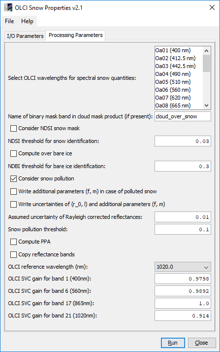

.. |vspace| raw:: latex

   \vspace{5mm}

.. |br| raw:: html

    

.. _s3snow_usage:

=========================================
How to run the S3-SNOW Processing Modules
=========================================

Test of the Installation
========================

If all plugins described in :ref:`s3snow_installation` were installed successfully in SNAP, the modules should be
visible in their dedicated menus as shown in the figure sequence :numref:`snow_properties_in_snap` to
:numref:`slope_in_snap`.

.. _snow_properties_in_snap:
.. figure::  pix/snow_properties_in_snap.png
   :align:   center
   :scale: 80 %

   The SNAP menu entry for the Snow Properties Processor.

.. _idepix_snow_in_snap:
.. figure::  pix/idepix_snow_in_snap.png
   :align:   center
   :scale: 80 %

   The SNAP menu entry for the IdePix Pixel ClassificationProcessor.

.. _o2corr_in_snap:
.. figure::  pix/o2corr_in_snap.png
   :align:   center
   :scale: 60 %

   The SNAP menu entry for the O2 Correction Processor.

.. _slope_in_snap:
.. figure::  pix/slope_in_snap.png
   :align:   center
   :scale: 60 %

   The SNAP menu entry for the Slope Processor.

The Snow Properties Processor
=============================

When the Snow Properties Processor is called from its menu entry, the processor GUI is displayed. It contains two
tabs 'I/O Parameters' and 'Processing Parameters' (:ref:`s3snow_iotab`, :ref:`s3snow_proctab`).

.. _s3snow_iotab:
.. figure::  pix/s3snow_iotab.png
   :align:   center
   :scale: 60 %

   The SNAP Snow Properties Processor: I/O parameters tab.

.. _s3snow_proctab:

   The SNAP Snow Properties Processor: processing parameters tab.
