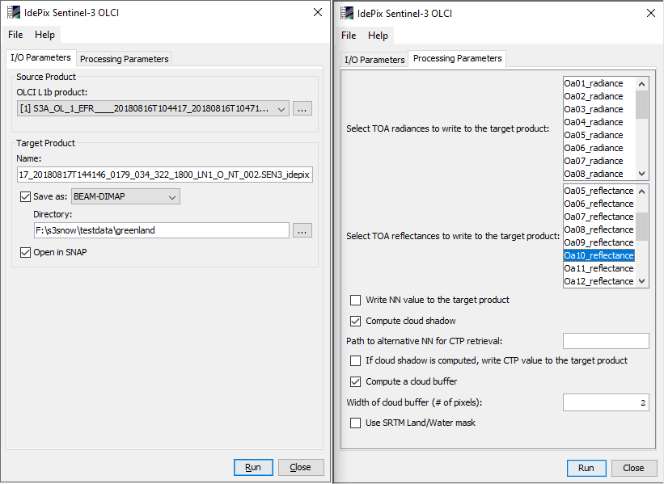
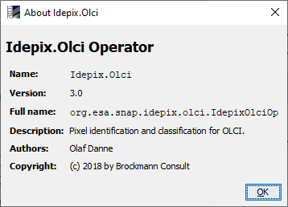

.. |vspace| raw:: latex

   \vspace{5mm}

.. |br| raw:: html

    

.. _s3snow_usage:

=================================
How to use the S3-SNOW Processors
=================================

Test of the Installation
========================

If all plugins described in chapter :doc:`s3snow_installation` were installed successfully in SNAP, the modules should be
visible in their dedicated menus as shown in the figure sequence :numref:`snow_properties_in_snap` to
:numref:`slope_in_snap`.

.. _snow_properties_in_snap:
.. figure::  pix/snow_properties_in_snap.png
   :align:   center
   :scale: 50 %

   The SNAP menu entries for the S3-SNOW and SICE Snow Properties Processors.

.. _idepix_in_snap:

   The SNAP menu entry for the IdePix Pixel Classification Processor.

.. _o2corr_in_snap:
.. figure::  pix/o2corr_in_snap.png
   :align:   center
   :scale: 50 %

   The SNAP menu entry for the O2 Harmonisation Processor.

.. _slope_in_snap:

   The SNAP menu entry for the Slope Processor.

Test Products
=============

The S3-SNOW project delivery D2.4 'Task 2 Data Base' contains a variety of suitable Sentinel-3 OLCI L1b products which
can be used for initial tests of the functionalities of the single processors as well as for the whole processing flow.
These products can also be obtained from the S3-SNOW ftp site hosted at BC with the
following configuration:

- FTP, Port 21
- ftp.brockmann-consult.de
- username: s3snow
- password: $3Sn0W@bc
- subdirectories: data/<region> (Dome-C, French Alps, Greenland, Morteratsch)

The SICE Snow Properties Processor
==================================

GUI Elements
------------

When the OLCI SICE Snow Properties Processor is called from its menu entry, the processor GUI is displayed. It contains two
tabs 'I/O Parameters' and 'Processing Parameters', as shown in (:numref:`s3snow_sice_tabs`).

.. _s3snow_sice_tabs:

   The SICE Snow Properties Processor: I/O and processing parameters tabs.

Help Documentation
------------------

From the main menu bar of the processor dialog window, an 'About' dialog showing general information on the
processor can also be displayed (:numref:`s3snow_sice_help_about`).

.. _s3snow_sice_help_about:

   The SNAP Snow Properties Processor: 'About' dialog window.

Also from the main menu bar of the processor dialog window, the SNAP specific help documentation for this processor can
be invoked (:numref:`s3snow_help_from_menu`, :numref:`s3snow_help`). This documentation contains some general information,
a description of the underlying algorithms (i.e. dedicated references), a description of the processor I/O interface,
a description of the processing parameters, and a description how to run the processor from the command line.

.. _s3snow_sice_help_from_menu:

   The SICE Snow Properties Processor: Accessing the SNAP desktop help documentation.

.. _s3snow_help:
.. figure::  pix/s3snow_help.png
   :align:   center
   :scale: 60 %

   The SICE Snow Properties Processor: Start page of the help documentation.

The S3-SNOW Snow Properties Processor
=====================================

GUI Elements
------------

When the S3-SNOW Snow Properties Processor is called from its menu entry, the processor GUI is displayed. It contains two
tabs 'I/O Parameters' and 'Processing Parameters', shown for SICE in (:numref:`s3snow_tabs`).

.. _s3snow_tabs:
.. figure::  pix/s3snow_tabs.png
   :align:   center
   :scale: 60 %

   The S3-SNOW Snow Properties Processor: I/O and processing parameters tabs.

Help Documentation
------------------

From the main menu bar of the processor dialog window, an 'About' dialog showing general information on the
processor can also be displayed (:numref:`s3snow_help_about`).

.. _s3snow_help_about:

   The SNAP Snow Properties Processor: 'About' dialog window.

Also from the main menu bar of the processor dialog window, the SNAP specific help documentation for this processor can
be invoked (:numref:`s3snow_help_from_menu`, :numref:`s3snow_help`). This help documentation entry is the same as
for the SICE processor.

.. _s3snow_help_from_menu:

   The S3-SNOW Snow Properties Processor: Accessing the SNAP desktop help documentation.

The IdePix OLCI Pixel Classification Processor
==============================================

GUI Elements
------------

When the IdePix OLCI Pixel Classification is called from its menu entry, the processor GUI is displayed. As all other
processors provided for S3-SNOW, it contains two tabs 'I/O Parameters' and 'Processing Parameters' (:numref:`idepix_tabs`).

.. _idepix_tabs:

   The IdePix OLCI Pixel Classification Processor: I/O and processing parameters tabs.

Help Documentation
------------------

From the main menu bar of the processor dialog window, an 'About' dialog showing general information on the
processor can be displayed (:numref:`s3snow_help_about`).

.. _idepix_help_about:

   The IdePix OLCI Pixel Classification Processor: 'About' dialog window.

As for all other processors provided for S3-SNOW / SICE, the SNAP specific help documentation for this processor can
be invoked from the main menu bar of the processor dialog window.
Again, this documentation contains some general information,
a description of the underlying algorithms (i.e. dedicated references), a description of the processor I/O interface,
a description of the processing parameters, and a description how to run the processor from the command line
(:numref:`idepix_help`).

.. _idepix_help:

   The IdePix OLCI Pixel Classification Processor: Start page of the help documentation.

The OLCI O2 Harmonisation Processor
==================================

GUI Elements
------------

When the OLCI O2 Harmonisation is called from its menu entry, the processor GUI is displayed. Again, this
processor contains two tabs 'I/O Parameters' and 'Processing Parameters' (:numref:`o2corr_tabs`).

.. _o2corr_tabs:

   The OLCI O2 Harmonisation Processor: I/O and processing parameters tabs.

Help Documentation
------------------

The 'About' information and help documentation can be accessed through the 'Help' menu in the same way as for all other
processors provided for S3-SNOW / SICE.

.. _o2corr_help:
.. figure::  pix/o2corr_help.png
   :align:   center
   :scale: 60 %

   The OLCI O2 Harmonisation Processor: Entry to help documentation.

The SNAP Slope Processor
========================

GUI Elements
------------

When the Slope Processor is called from its menu entry, the processor GUI is displayed. Again, this
processor contains two tabs 'I/O Parameters' and 'Processing Parameters' (:numref:`slope_tabs`).

.. _slope_tabs:

   The SNAP Slope Processor: I/O and processing parameters tabs.

Help Documentation
------------------

The 'About' information and help documentation can be accessed through the 'Help' menu in the same way as for all other
processors provided for S3-SNOW / SICE.

.. _slope_help:

   The Slope Processor: Entry to help documentation.
